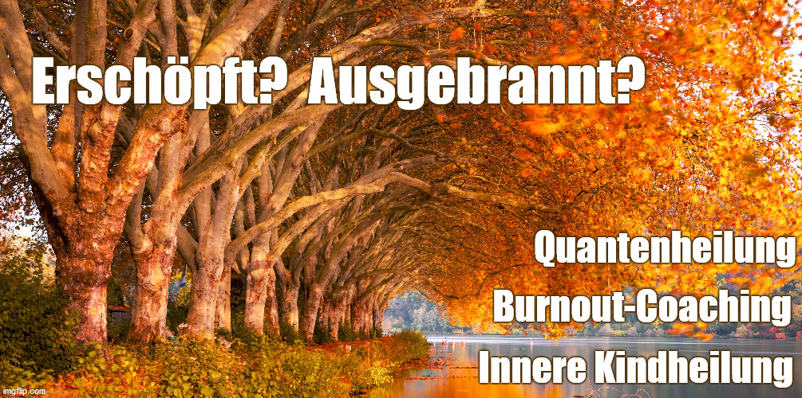

  <section id="banner">
	

	<header>
	<h1>Willkommen</h1>
	
Ein Ort für Achtsamkeit

	</header>
	

	
 <h3> Praxis für Traumaheilung und Coaching </h3> 

	
 Ich bin Traumatherapeutin (hp psych) und Coach. Ich begleite Menschen, die ihr Leben selbstbestimmt gestalten wollen. Menschen, die bisher mit 		Stressfolgeerkrankungen kämpfen, seelisch belastet sind oder die sich in alten Mustern verstrickt haben und die nun endlich das leben wollen, 			wonach sich ihre Seele in ihrem Innersten sehnt. 

	
	
<h4> Das Angebot meiner Praxis: </h4> 

	
	<li> Psychodynamische imaginative sowie enaktive Traumatherapie nach Luise Reddemann und Ellert Nijenhuis, EMDR und Hypnotherapie</li>
	<li> Innere Kindheilung - Coaching</li>
	<li> Einzelaufstellungen/InnerSpace </li>
	<li> Energiearbeit </li>
	<ul>
	
 Lassen Sie seelische Zustände wie mangelnde Energie, Gefühl von Fremdbestimmung, häufige ungewollte Stressreaktionen des Körpers hinter sich. Werden Sie emotional stabil. Halte Sie sich nicht mehr mit emotionalen Triggern, alten Zellerinnerungen, (transgenerationalen) Traumatisierungen usw. von Ihrem selbstbestimmten Leben ab. Lassen Sie Mitgefühl für sich und das Leben um sich einfließen.

	
Hier finden Sie ganzheitliche, achtsame Lösungswege, sodass Sie Ihren Lebensweg kraftvoll selbst bestimmen können. Von wissenschaftlich fundiert 		über Naturheilkunde bis spirituell erweiternd binde ich zielgerichtet Heiltools in meine Arbeit als Traumatherapeutin, Heilpraktikerin für Psychotherapie, Coach und energetische Begleiterin ein. Mehr [über mich](/about/). 

	

<h4>Ein Feedback zu meiner Inneren Kindheilung - Coaching, von Maria W. aus Liechtenstein: </h4>
 

"Nun möchte ich, bevor das Alltagsleben mich einholt, dir grad noch ein
Feedback geben.
 

Das Angebot mich zu unterstützen um hinzuschauen, wo die
Blockade noch verankert ist in meinem Lebensverlauf, um es zu integrieren
hab ich gerne angenommen, weil mich neue Herangehensweisen immer
interessieren. Dass es dann so hilfreich und klarmachend ist, hat mich
selbst erstaunt. Durch deine Technik und liebevolle Art, mich mit den
richtigen Fragen zum Hinschauen zu bewegen, konnte ich sogar das darunter
liegende Thema noch entdecken und herauslösen, um es anzuschauen. So
verstand ich endlich, welche Ängste mich zum Mauer-aufrecht-erhalten
bewegten, um ja nicht verletzt zu werden. Das verstehen war der eine
Schritt, zu dem du mir verholfen hast. Weiters zeigtest du mir auch mit
deiner Technik, welche Schritte helfen, um die Annäherung zum kleinen Ich
zu ermöglichen. Das wiederum zeigt mir, welche Veränderungen ich in
meinem Verhalten tun kann, um genau dies im Alltag zu erreichen. Und dann
kurz vor dem Abschluss zeigte sich die 2. Angst, zu der wir hingeschaut
haben - und mithilfe deiner Inspiration bin ich nun daran, auch hier das
Schattenverhalten zu korrigieren.
 

 Deine Art, mich dahin zu führen, ist Hilfreich, Kompetent, Achtsam und
sehr Erkenntnisreich und vorallem wirklich befreiend.
 

 hey du liebe, das war wirklich ein Schlüssel, um so schnell
voranzukommen. Das ich deine Hilfe bekam! ein riesiges Dankeschön von
mir zu dir!" 
 

	
<h3 id="hier-findest-du-antworten-die-funktionieren">Hier findest Du Antworten, die funktionieren.</h3>

	
Manchmal ist es notwendig, in die Vergangenheit zu tauchen und alte Knoten zu lösen. Sobald das erledigt ist, können wir unsere Zeit damit verbringen, unsere Lebenszeit zum Aufbau unseres selbstbestimmten Lebens zu nutzen. In der Vergangenheit herumzufischen hat keinen Selbstwert - zumindest würde ich das nicht als Hobby betreiben. Was ein erfülltes Leben ausmacht? In Leichtigkeit magnetisch anziehen, was uns wirklich Sinn für unser Leben gibt.

		
		
In meinem Blog schreibe ich im Wesentlichen darüber, wie ich meinen Weg in die fünfte Dimenstion gefunden habe und was Dir vielleicht Inspiration sein kann, Dein Leben voller Energie zu kreieren:

		<ul>
	<li><strong>Mein Blog:</strong> "5. Dimension: Auch Buddha ging ins Homeoffice" - mit ganzheitlichem Wissen um emotionale Stabilität, Energie und Kraft für ein selbstbestimmtes Leben<strong><a href="/blog.html">Selbsthilfetools für Zuhause</a></strong></li>
	<li><strong>mit meiner persönlichen Begleitung</strong> auf Deinem Weg aus der Krise? <strong>Lerne <a href="/about/">mich kennen</a></strong>.</li>
	</ul>
	

	

	
	
	
</section>
